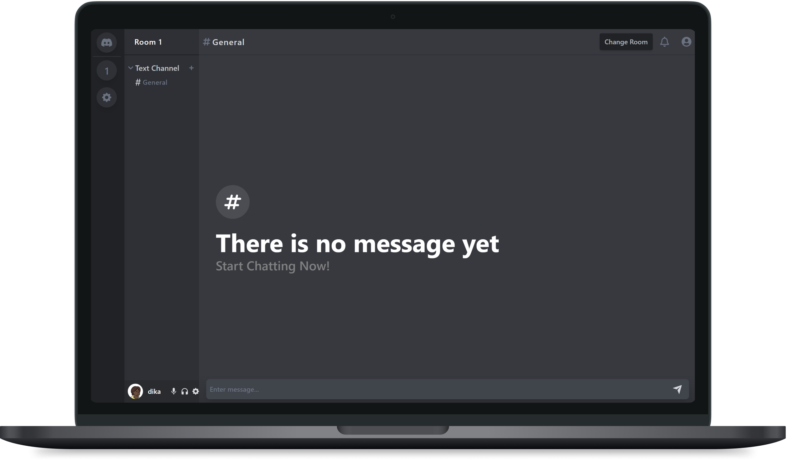
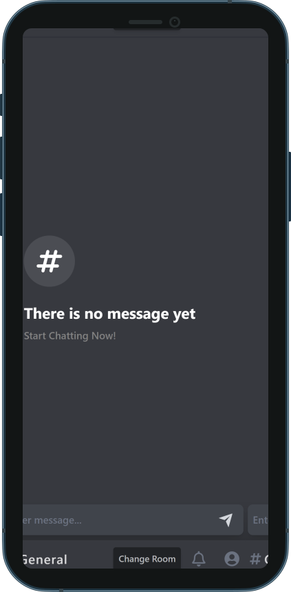

# Chatting App


<p align="center">
  
</p>
This project is still on going

## Preview of the Web

The Preview of the app can be viewed [`here`](https://chat.andikay.me)

## How to use

If you want to build it from scratch, use [`create-react-app`](https://www.freecodecamp.org/news/how-to-create-a-react-app-with-a-node-backend-the-complete-guide/) with [npm](https://docs.npmjs.com/cli/init) or [Yarn](https://yarnpkg.com/lang/en/docs/cli/create/) to bootstrap the example. You can also clone the project

```bash
npm install
```
